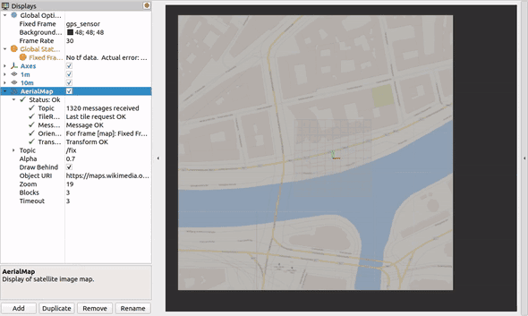

# rviz_satellite

Rviz plugin for displaying satellite maps at the position of a `sensor_msgs/msg/NavSatFix` message.

> **_NOTE:_**  Looking for the ROS1 version? Checkout the ros1 branch!

## Usage

Add an instance of `AerialMap` to your Rviz config and point it to a `sensor_msgs/msg/NavSatFix` topic.

Map tiles will be cached to `$HOME/.cache/rviz_satellite`.
At present the cache does not expire automatically - you should delete the files in the folder if you want the images to be reloaded.

Currently, the [OpenStreetMap](http://wiki.openstreetmap.org/wiki/Slippy_map_tilenames) convention for tile URLs is supported.
This e.g. implies that only raster tiles (no vector tiles) are supported.

To try a demo, run the following commands to make Rviz circle around a geo point you define.

```bash
ros2 launch rviz_satellite demo.launch.xml
```

You should see a view like the following.
Here, the coordinates are 48.211486, 16.383982 (Vienna), using OpenStreetMap tiles.



## Tile servers

You must provide a tile URL (Object URI) from which the satellite images are loaded.
The URL should have the form `http://server.tld/{z}/{x}/{y}.jpg`.
Where the tokens `{z}`, `{x}`, `{y}` represent the zoom level, x coordinate, and y coordinate respectively.
These will automatically be substituted by rviz_satellite when making HTTP requests.

Tiles can optionally be loaded from a local filesystem if downloaded beforehand
for cases where robots do not have internet access. For example, the file URI
`file:///tmp/tile/{z}/{y}/{x}.jpg` can be used to load files from the `/tmp/tile` directory.

rviz_satellite doesn't come with any preconfigured tile URL.
For example, you could use one of the following tile servers:

* OpenStreetMap: https://tile.openstreetmap.org/{z}/{x}/{y}.png
* TomTom: https://api.tomtom.com/map/1/tile/basic/main/{z}/{x}/{y}.png?tileSize=512&key=[TOKEN]
* Mapbox: https://api.mapbox.com/styles/v1/mapbox/satellite-v9/tiles/256/{z}/{x}/{y}?access_token=[TOKEN]

For some of these, you have to request an access token first.
Please refer to the respective terms of service and copyrights.

## Options

- `Topic` is the topic of the GPS measurements.
- `Alpha` is simply the display transparency.
- `Draw Behind` will cause the map to be displayed below all other geometry.
- `Zoom` is the zoom level of the map. Recommended values are 16-19, as anything smaller is _very_ low resolution. 22 is the current max.
- `Blocks` number of adjacent tiles in addition to the center tile to load, 8 maximum.
- `Timeout` specifies a timeout since the last received message timestamp, after which the map will be faded out; disable by setting to 0.

## Local Maps

If you want to use a tile server which only supports a specific region instead of the whole world you can enable the `Use Local Map` option. This also means that the zoom levels and tile coverage (see [here](https://wiki.openstreetmap.org/wiki/Slippy_map_tilenames#Zoom_levels)) deviate and need to be defined manually. In particular, the `local origin` is the top-left corner of the local map region.

The options can be set after unfolding the top-level `Use Local Map` option:

- `Meter per Pixel (Zoom 0)` defines the length of a pixel edge in the image in meter at zoom level 0. Default is 0.0.
- `Origin CRS` is the [epsg code](https://epsg.io/) of the coordinate reference system (CRS) of the local origin (should be a cartesian coordinate system). Default is not set.
- `Origin X` is the X position of the local origin in given CRS system. Default is 0.0.
- `Origin Y` is the Y position of the local origin in given CRS system. Default is 0.0.

### Example Usage

Public orthographic photos are povided by [Geobasis NRW](https://www.bezreg-koeln.nrw.de/geobasis-nrw/webdienste/geodatendienste) and publicly available using the scheme described [here](https://www.wmts.nrw.de/geobasis/wmts_nw_dop/tiles/nw_dop/EPSG_25832_16/1.0.0/WMTSCapabilities.xml). The tiles only cover a smaller part of western Germany but have a very high resolution. The following options can be used and directly derived from the scheme.

- `Object URI: https://www.wmts.nrw.de/geobasis/wmts_nw_dop/tiles/nw_dop/EPSG_25832_16/{z}/{x}/{y}`
- `Meter per Pixel (Zoom 0): 4897.97` 
- `Origin CRS: EPSG:25832` 
- `Origin X: -46133.17`
- `Origin Y: 6301219.54`

## Support and Contributions

In case of questions or problems, do not hesitate to open an issue.

Contributions are welcomed. Please add a summary of your changes to the [changelog](CHANGELOG.rst) under the section Forthcoming.

## Icon copyright

The icon was downloaded and edited from [svgrepo](https://www.svgrepo.com/svg/118507/satellite), originally licensed under CC0.
